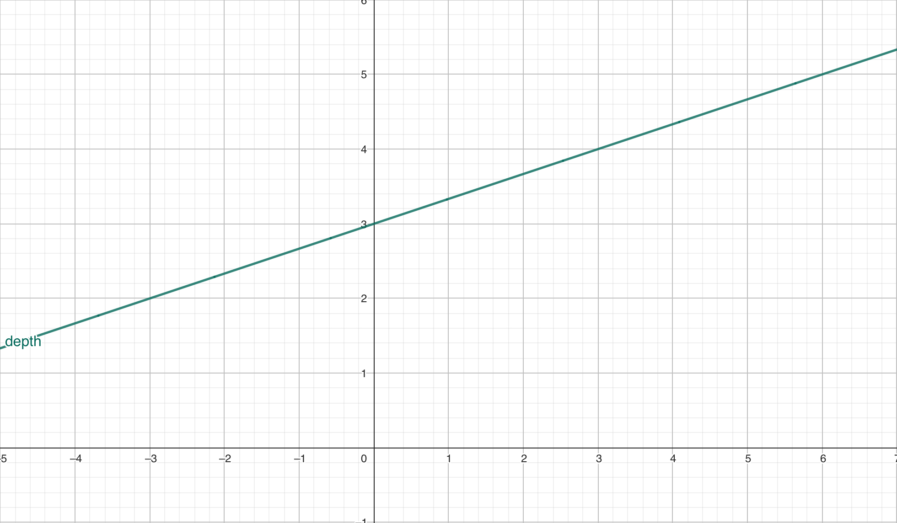

# Null Move Pruning (NMP)

Null Move Pruning that prunes branches where we are still winning even when we pass the opponent a free move (or we make a null move). So by giving the opponent the free turn and the search result still causing a fail high we can assume that the position is too good for us, thus we can prune these branches.

## Implementation 

Let's take a look at an example code from Schönemann.

```c++

if (!pvNode && depth > 3 && !inCheck && staticEval >= beta) {

        const int nmpDepthReduction = 3 + depth / 3;

        board.makeNullMove();

        const int score = -pvs(-beta, -alpha, depth - nmpDepthReduction, ply + 1, board, !cutNode);

        board.unmakeNullMove();

        if (score >= beta) {

            return score;

        }

    }

```

A few conditions must be met so that we can go into NMP, like not being in a PV-Node or that we are not in check. 

### Depth Reduction

We have the following formula for increasing our depth reduction:

```c++

3 + depth / 3;

```

which visualized looks like this:




