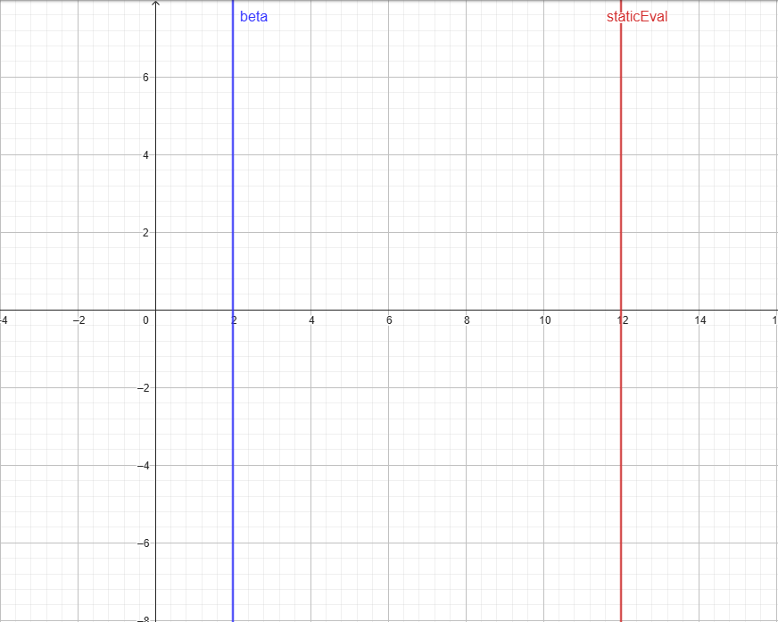
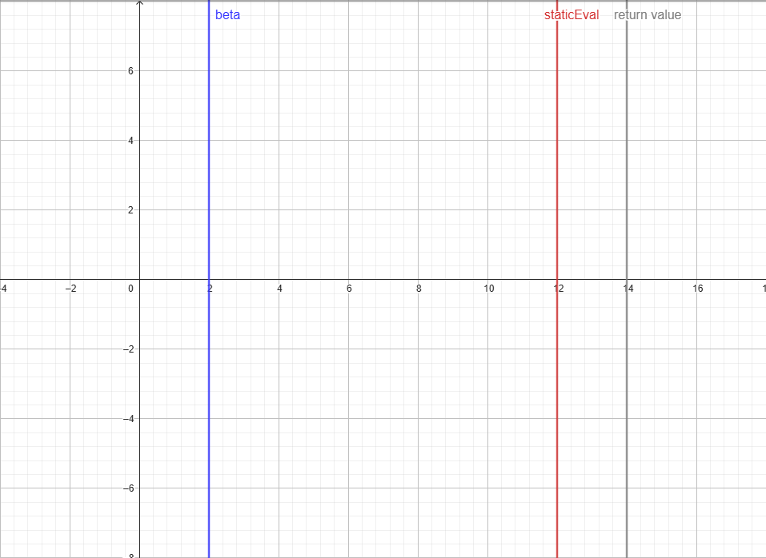
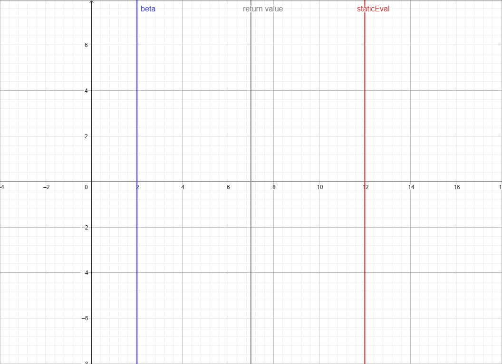

# __Reverse Futility Pruning (RFP)__

---

Reverse Futility Pruning is a pruning technique that is used to prune branches that are too good for us. The opponent will therefore avoid these branches. This is done by using the upper bound of our search (beta) and comparing it to our static evaluation of our position. If the static evaluation is greater than or equal to beta (or, in other words, caused a fail high), then we prune the branch.

---

Example code (taken from Schoenemann):

```c++

if (!inCheck && !pvNode && depth < 9 && staticEval - 100 * depth >= beta) {
    return staticEval;
}

```

---

## __Fail Medium__
 
A way to gain elo is to adjust the return value of RFP. One way of doing this is by taking an average of the upper bound (beta) and the static evaluation. This could look like the following code:

```c++

return (staticEval + beta) / 2;

```

---

Let's visualize this with an example. We assume that our static evaluation has the value `12` (we exclude the depth margin here, which in the example is `- 100 * depth`) and beta, which has the value `2`. So our initial window looks like this:

---



---

So now we add up the static evaluation and beta. This leads to the following result:

---



---

Now finally, we divide by two to get our final return value.

---



---

As you can see now, we have a return score that sits between our static evaluation and beta. This helps the search because we don't know the true return score since the static evaluation is only an estimated score and beta is only the upper bound. So by doing this we don't make the program too optimistic or underestimate the position.

---
